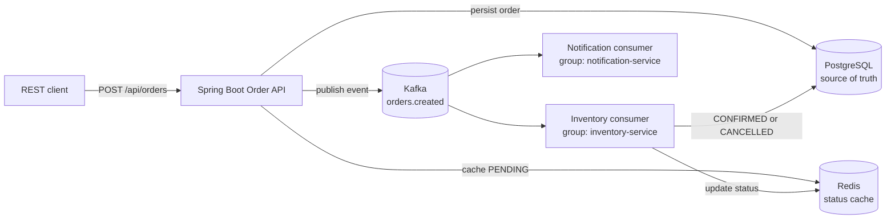

# Event-Driven Order System


A compact Spring Boot application demonstrating how synchronous order creation can be combined with asynchronous event processing.

The project is intentionally implemented as a modular monolith: it keeps local development and testing simple while preserving clear boundaries between the order API, persistence, cache, event producer, and independent Kafka consumers.

## Architecture



### Processing flow

1. The API validates the request, calculates the total, and persists the order as `PENDING`.
2. The initial status is written to Redis and an `OrderCreatedEvent` is published to Kafka.
3. The inventory consumer simulates item reservation and changes the status to `CONFIRMED` or `CANCELLED`.
4. The notification consumer independently reacts to the same event and logs a confirmation notification.
5. Duplicate inventory deliveries are ignored using an event ID stored in Redis with a TTL.

PostgreSQL remains the durable source of truth. Redis is used for fast status reads and lightweight idempotency tracking. Kafka decouples order creation from downstream processing.

## Design decisions

### PostgreSQL

PostgreSQL is the durable source of truth for orders and their current state.

### Redis

Redis is used for frequently accessed order status and short-lived idempotency keys. Losing Redis does not result in data loss because PostgreSQL remains authoritative.

### Kafka

Kafka decouples order creation from downstream processing. Inventory and notification consumers process the same event independently and can operate at different rates.

### Modular monolith

The application uses a modular monolith rather than multiple deployable services to keep the project lightweight while maintaining clear boundaries between responsibilities.

## Features

- REST API for creating and retrieving orders
- Request validation with structured error responses
- PostgreSQL persistence using Spring Data JPA
- Versioned database schema managed by Flyway
- Kafka event publishing with JSON-serialized events
- Independent inventory and notification consumer groups
- Redis cache-aside pattern for order status
- Idempotent inventory event processing
- Docker Compose environment for local development
- Integration testing with Testcontainers for PostgreSQL, Redis, and Kafka

## Technology stack

| Area | Technology |
| --- | --- |
| Language | Java 21 |
| Framework | Spring Boot 4.1 |
| HTTP | Spring Web MVC |
| Persistence | Spring Data JPA, Hibernate 7 |
| Database | PostgreSQL 16 |
| Migrations | Flyway |
| Messaging | Apache Kafka 4 |
| Cache | Redis 7 |
| Testing | JUnit, Spring Boot Test, Testcontainers |
| Build | Gradle Kotlin DSL |

## Prerequisites

- JDK 21
- Docker Engine with Docker Compose
- A terminal with permission to run Gradle and Docker

## Quick start

Start the infrastructure:

```bash
docker compose up -d
```

Run the application with Gradle:

```bash
./gradlew bootRun
```

On Windows PowerShell:

```powershell
.\gradlew.bat bootRun
```

The application starts on `http://localhost:8080`.

Stop the infrastructure when finished:

```bash
docker compose down
```

## API

### Create an order

```http
POST /api/orders
Content-Type: application/json
```

```json
{
  "customerId": "customer-123",
  "items": [
    {
      "productId": "product-1",
      "quantity": 2,
      "unitPrice": 19.99
    },
    {
      "productId": "product-2",
      "quantity": 1,
      "unitPrice": 9.99
    }
  ]
}
```

Example with `curl`:

```bash
curl -X POST http://localhost:8080/api/orders \
  -H "Content-Type: application/json" \
  -d '{"customerId":"customer-123","items":[{"productId":"product-1","quantity":2,"unitPrice":19.99},{"productId":"product-2","quantity":1,"unitPrice":9.99}]}'
```

Response:

```json
{
  "id": "8c7e7b4e-9a8f-4a5d-b3d6-8c7c98b1f8a1",
  "customerId": "customer-123",
  "status": "PENDING",
  "totalPrice": 39.98,
  "createdAt": "2026-08-16T15:30:00Z"
}
```

### Get an order

```http
GET /api/orders/{orderId}
```

Returns the durable order record from PostgreSQL.

### Get order status

```http
GET /api/orders/{orderId}/status
```

Example response:

```json
{
  "orderId": "8c7e7b4e-9a8f-4a5d-b3d6-8c7c98b1f8a1",
  "status": "CONFIRMED",
  "source": "redis"
}
```

The first status lookup can fall back to PostgreSQL and populate Redis. Later lookups use the cache until the configured TTL expires.

### Order lifecycle

```text
POST /api/orders
        |
        v
     PENDING
        |
        v
  Kafka processing
        |
        v
  CONFIRMED or CANCELLED
```

After creating an order, query its asynchronously updated status:

```bash
curl http://localhost:8080/api/orders/{orderId}/status
```

The response will look similar to:

```json
{
  "orderId": "8c7e7b4e-9a8f-4a5d-b3d6-8c7c98b1f8a1",
  "status": "CONFIRMED",
  "source": "redis"
}
```

## Configuration

The application uses local Docker defaults, which can be overridden with environment variables:

| Variable | Default | Description |
| --- | --- | --- |
| `DB_URL` | `jdbc:postgresql://localhost:5432/orders` | PostgreSQL JDBC URL |
| `DB_USERNAME` | `orders` | PostgreSQL username |
| `DB_PASSWORD` | `orders` | PostgreSQL password |
| `REDIS_HOST` | `localhost` | Redis hostname |
| `REDIS_PORT` | `6379` | Redis port |
| `KAFKA_BOOTSTRAP_SERVERS` | `localhost:9092` | Kafka bootstrap servers |
| `APP_CACHE_STATUS_TTL` | `PT30M` | Order status cache lifetime |
| `APP_CACHE_IDEMPOTENCY_TTL` | `PT24H` | Processed event key lifetime |

Flyway owns the schema, while Hibernate runs with `ddl-auto=validate`. This prevents the ORM from silently modifying the database structure.

## Testing

Run the complete test suite:

```bash
./gradlew test
```

On Windows PowerShell:

```powershell
.\gradlew.bat test
```

The Testcontainers test starts PostgreSQL, Redis, and Kafka automatically, so Docker must be running. The test verifies that the Spring application context, database migration, repositories, Redis integration, and Kafka listeners can initialize together.

## Project structure

```text
src/main/java/dev/asyncluna/orders
├── api                 # REST error handling
├── cache               # Redis status cache and idempotency keys
├── kafka
│   ├── consumer        # Inventory and notification consumers
│   ├── event           # Transport-level event records
│   └── producer        # Kafka event publishing
└── order
    ├── controller      # HTTP endpoints
    ├── dto             # Request and response models
    ├── entity          # JPA entities and order status
    ├── repository      # PostgreSQL access
    └── service         # Order creation and status orchestration

src/main/resources
├── application.yaml
└── db/migration        # Flyway SQL migrations
```

## License

This project is licensed under the [MIT License](LICENSE).
